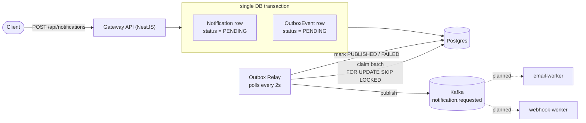

# Notification Platform

Event-driven notification delivery system. A gateway API accepts notification requests, persists them, and reliably hands them off to Kafka for asynchronous delivery — built to demonstrate operating an event-driven system correctly, not just wiring one up.

## Architecture



The gateway never talks to Kafka directly on the request path. It writes the `Notification` and a matching `OutboxEvent` in one transaction and returns — a separate relay process is the only thing that publishes to Kafka. See [Why the outbox pattern](#why-the-outbox-pattern) for the failure mode this avoids.

## Current status

| Phase | Scope                                                                    | Status  |
| ----- | ------------------------------------------------------------------------ | ------- |
| 0     | Local infra (Docker Compose Kafka, Postgres via Supabase)                | ✅      |
| 1     | Gateway API + transactional outbox + relay                               | ✅      |
| 2     | `email-worker` — consumes `notification.requested`, retries with backoff | 🔜 next |
| 3     | `webhook-worker` + Redis idempotency + rate limiting                     | planned |
| 4     | Containerize all services                                                | planned |
| 5     | Kubernetes (Helm chart, probes, resource limits)                         | planned |
| 6     | Autoscaling with KEDA (scale workers on queue depth)                     | planned |
| 7     | Observability (Prometheus + Grafana)                                     | planned |
| 8     | CI/CD (GitHub Actions build/push/deploy)                                 | planned |

## Why these decisions

### Why the outbox pattern

Writing to Postgres and publishing to Kafka are two separate systems — there's no way to commit both atomically. Publishing directly from the request handler (write DB → call Kafka) means a crash or broker hiccup between those two steps silently drops the event forever, even though the client already got a success response.

The outbox pattern writes the event to an `OutboxEvent` table in the **same transaction** as the domain write, so it's committed atomically with the `Notification` row. A separate `OutboxRelayService` polls for `PENDING` rows and publishes them to Kafka, retrying on failure (`attempts` + `lastError` tracked per row, capped and marked `FAILED` after 10 attempts). Claiming uses `SELECT ... FOR UPDATE SKIP LOCKED`, so this is safe to run from multiple gateway replicas without double-publishing — a deliberate choice ahead of the Kubernetes phase.

### Why Kafka

Chosen for partitioned, replayable, ordered-per-key delivery to multiple independent consumer groups (email/webhook workers now, more channels later) — a better fit than a traditional queue for a system expected to grow more consumer types over time.

### Why Nx + pnpm workspaces

`gateway`, `libs/kafka`, `libs/contracts`, and `libs/database` are separate buildable packages so the eventual worker services can depend on the same Kafka client and event contracts without duplicating code.

## Event schema

```ts
interface NotificationRequestedEvent {
  eventId: string;
  notificationId: string;
  tenantId: string;
  channel: 'EMAIL' | 'WEBHOOK';
  recipient: string;
  payload: Record<string, unknown>;
  createdAt: string;
}
```

Defined in `libs/contracts` so producers and (future) consumers share the same type.

## Getting started

**Prerequisites:** Node 22+, pnpm, Docker.

```sh
# 1. Start local Kafka
docker compose up -d

# 2. Configure environment
cp .env.example .env
# fill in DATABASE_URL (any reachable Postgres instance)

# 3. Install dependencies
pnpm install

# 4. Apply database migrations
pnpm exec prisma migrate dev

# 5. Run the gateway
pnpm nx serve gateway
```

Send a test request:

```sh
curl -X POST http://localhost:3000/api/notifications \
  -H "Content-Type: application/json" \
  -d '{"channel":"EMAIL","recipient":"user@example.com","payload":{"subject":"hi"}}'
```

## Project structure

```
gateway/          NestJS API — HTTP layer, notification persistence, outbox relay
libs/contracts/   Shared event type definitions
libs/kafka/       Kafka client (NestJS ClientKafka wrapper, producer-only)
libs/database/    Prisma client + schema (Notification, OutboxEvent)
prisma/           Schema and migrations
```

## Testing

```sh
pnpm nx run-many -t lint,typecheck,test,build
```
